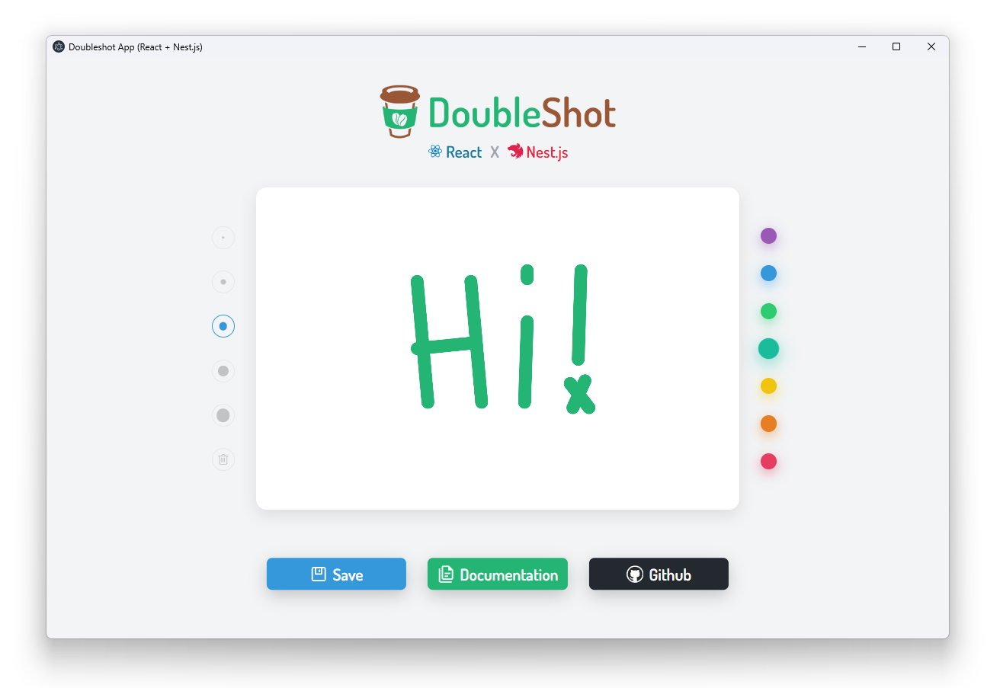

<p align="center">
    
</p>

<br>

## Template with <font color="#42b983">Vue.js</font> + <font color="#ea2845">Nestjs</font>

This template uses [Vue.js](https://vuejs.org/) and [Vite](https://vitejs.dev/) for the frontend part and [NestJS](https://nestjs.com/) in [Electron](https://www.electronjs.org/) for the backend (main process) part. And it's powered by [**<font color="#24b574">Double</font><font color="#995735">Shot</font>**](https://github.com/Doubleshotjs/doubleshot).

## How to use

It is recommended to use [pnpm](https://pnpm.io/) as the default package manager.

- Install dependencies first:

  ```sh
  pnpm install
  ```

- Run in development mode:

  ```sh
  pnpm dev
  ```

- Build for production:

  ```sh
  pnpm run build
  ```

## Directory
```sh
  ├─┬ packages
  │ ├── backend                   # backend/main process part
  │ └── frontend                  # frontend/renderer process part
  ├── electron-builder.config.js  # electron-builder config file
  ├── package.json
  └── dsr.config.ts               # @doubleshot/runner config file
```